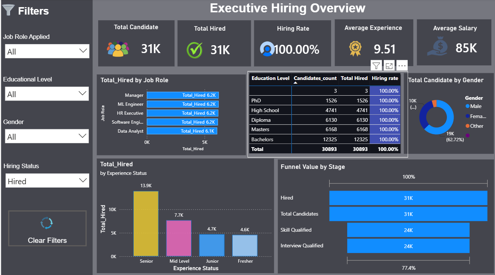
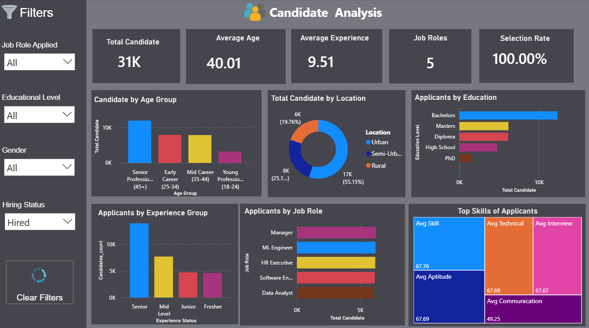
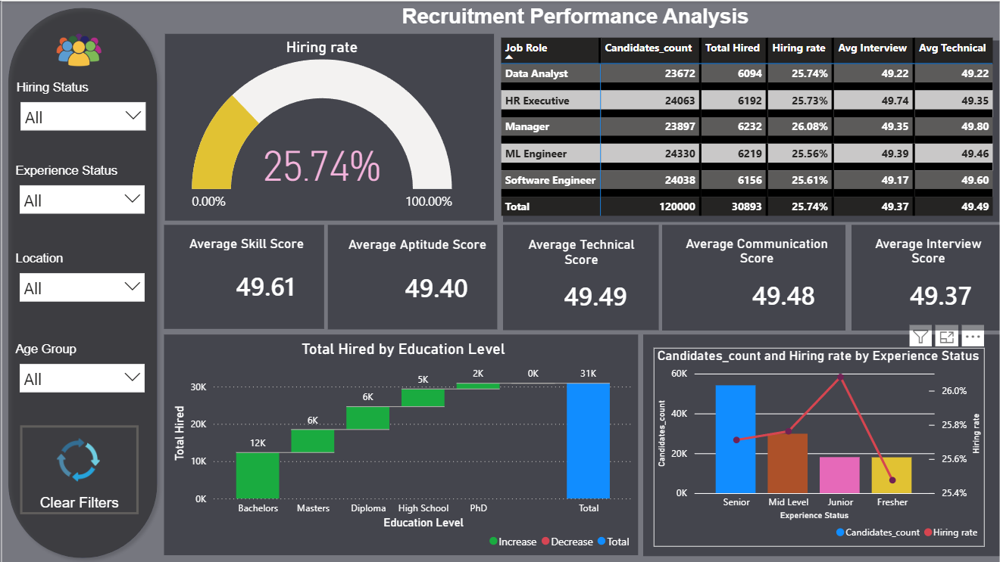

# 📊 HR Recruitment Analytics Dashboard

## 📌 Project Overview

This project is an interactive **Power BI dashboard** developed to analyze HR recruitment data and provide meaningful insights into the hiring process.

## 🎯 Objectives

- Analyze recruitment trends
- Measure hiring performance
- Evaluate candidate profiles
- Support data-driven recruitment decisions

## 🛠️ Tools & Technologies

- Power BI
- Microsoft Excel
- Power Query
- DAX

## 📈 Dashboard Pages

### 1. Executive Hiring Overview
- Total Candidates
- Total Hires
- Hiring Rate
- Department-wise Hiring
- Job Role Analysis

### 2. Candidate Analysis
- Age Distribution
- Gender Distribution
- Education Level
- Experience Analysis

### 3. Recruitment Performance
- Interview Performance
- Recruitment Funnel
- Hiring Success Rate
- Performance Metrics

### 4. Recruitment Insights & Hiring Quality
- Hiring Quality Analysis
- Department Insights
- Recruitment Trends
- Business Insights

## 📸 Dashboard Screenshots

### Executive Hiring Overview

### Candidate Analysis

### Recruitment Performance

### Recruitment Insights & Hiring Quality

## 📁 Dataset

- **Dataset Name:** AI Fair Recruitment Analytics Dataset
- **Source:** Kaggle
- **Size:** 120,000+ Records
- **Description:** Used to analyze recruitment processes, hiring trends, and candidate outcomes.

## ✨ Key Features

- Interactive dashboard
- KPI cards
- Dynamic slicers
- Hiring trend analysis
- Candidate performance analysis
- Department-wise insights
- Recruitment quality metrics

## 📌 Project Outcome

This dashboard helps HR teams monitor recruitment performance, identify hiring trends, and make informed recruitment decisions using interactive visualizations.
